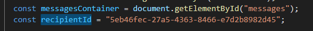
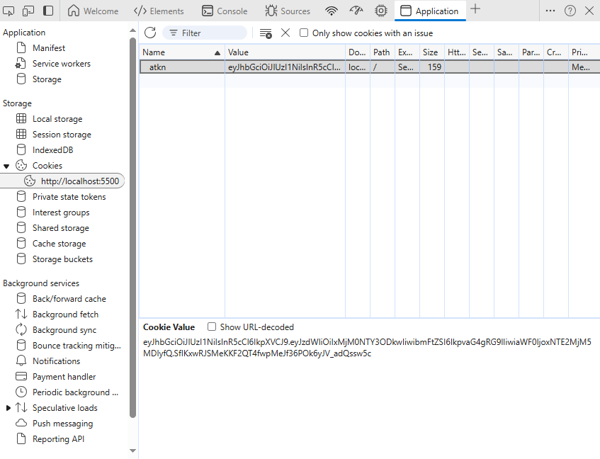

### How to use the **HTML CHAT** test 
> Please follow the instructions below to test the chat application. *Please ensure the application server is running.*

1. Open `chatTest1.html` and `chatTest2.html` in your editor and change the `recipientId` to existing userIDs respectively. *ensure they are not same ID*  
__*Example*__

2. Run the first html `chatTest1.html` with VSCode liveserver extension or any other platform of your choice. *you can download the liveserver by navigating to the `Extensions` (Ctrl+Shift+X) in VScode and searching for 'LiveServer'.*  
> click the `Go Live` to run the file with LiveServer

3. open the url(`localhost:5500/chatTest1.html` if using LiveServer) in your browser

4. Set a cookie `atkn` in the browser's developer tool 'application' section. the value of the cookie should be a valid access token for the user whose ID is the value of `recipientID` in the `chatTest2.html` file.  
**_Example:_**

5. Open the second html (`localhost:5500/chatTest2.html` if using LiveServer) in a **separate browser**.

6. repeat step 4, ensure the value if the cookie is an access token for the user whose ID is the value of `recipientID` in the `chatTest1.html` file.

7. Once all are set, reload both browsers and start to chat.